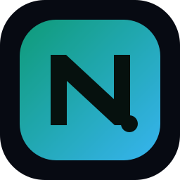
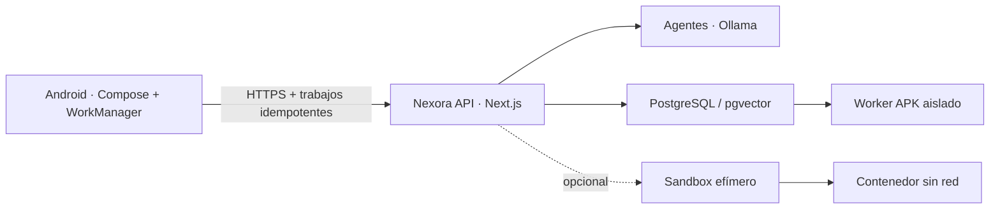

<div align="center">
  
  <h1>Nexora AI</h1>
  <p><strong>Tu inteligencia. Tu servidor.</strong></p>
  <p>Plataforma de IA privada para programación, Android, backend, datos, DevOps y ciberseguridad defensiva, con API propia y aplicación móvil.</p>

  [](apps/android/GhostNexoraAndroid)
  [](apps/android/GhostNexoraAndroid)
  [](apps/android/GhostNexoraAndroid/app/src/main/cpp)
  [](package.json)
  [](docker-compose.vps.yml)
  [](https://ollama.com)
  [](docs/SUPPORT-MATRIX.md)
  [](docs/SUPPORT-MATRIX.md)
  [](https://github.com/Gh0stDeveloper/NexoraAI/actions)

  [Página oficial](https://ghostnexoraai.duckdns.org) ·
  [Estado de API](https://apighostnexoraai.duckdns.org/api/mobile/status) ·
  [Instalación](docs/README-INSTALL.md) ·
  [Actualización](docs/README-UPDATE.md)
</div>

---

## ✨ Qué incluye la versión 0.6.0

- 📱 Aplicación Android nativa con Kotlin y Jetpack Compose.
- 💬 Asistente general para conversaciones normales, además de especialistas técnicos.
- ♻️ Solicitudes persistentes: cerrar o cambiar de chat no cancela la respuesta.
- 🔎 Historial buscable con chats, proyectos, fijados y estados en segundo plano.
- 🧠 Respuestas instantáneas o colaboración de 3, 4 y 6 agentes.
- ⏱️ Cronómetro real, etapas de actividad y tiempo total de pensamiento.
- 📌 Chats y proyectos fijados; chats organizados dentro de proyectos.
- 📎 Análisis de imágenes, texto, código, PDF y documentos Word.
- 🧪 Laboratorio opcional de código en contenedores efímeros y limitados.
- 🔒 HTTPS en producción, política defensiva y ejecución peligrosa desactivada por defecto.
- ⚙️ Código nativo C/JNI compilado como la librería genérica `libnexora.so`.
- 🌐 Landing pública optimizada para SEO y descarga del APK, sin chat web.
- 🐳 API, Ollama y PostgreSQL listos para Docker Compose en VPS propia.
- 🔁 Actualización, respaldo, verificación y rollback mediante el comando `nexora`.
- 🔑 Compilación release en VPS AMD64 con SDK, Gradle y keystore persistentes.
- 📦 Publicación oficial automática mediante `latest.json` y firma V1+V2+V3.
- ⏳ APK temporales solicitados desde una respuesta, con URL privada de una hora.
- ✅ GitHub Actions para web/API, Android, Docker, dataset y compatibilidad Linux.

> [!IMPORTANT]
> La aplicación muestra etapas operativas seguras, no la cadena privada de razonamiento del modelo. La URL de una API usada por un APK nunca puede considerarse un secreto; la seguridad real debe estar en HTTPS, autenticación, autorización, límites y controles del servidor.

## 🧭 Arquitectura



| Capa | Tecnología | Función |
|---|---|---|
| Web pública | Next.js 16, React 19, TypeScript, CSS | Presentación, SEO, descarga, términos y privacidad |
| API | Next.js Route Handlers, Zod | Validación, chat móvil, progreso NDJSON y estado |
| IA | Ollama, modelos configurables | Inferencia local y colaboración por roles |
| Android | Kotlin 2, Jetpack Compose, WorkManager | Chats, historial, recuperación, adjuntos y actividad persistente |
| Nativo Android | C, JNI, CMake, NDK | Puente nativo, registro dinámico y endurecimiento del binario |
| Datos | PostgreSQL 16, pgvector | Base preparada para usuarios, RAG, auditoría y métricas |
| Aislamiento | Docker CLI, contenedores desechables | Validación opcional de Python, JavaScript y Bash |
| APK de usuarios | Worker sin socket Docker, plantilla fija | Cola limitada, firma separada y descarga temporal |
| Operación | Docker Compose, Nginx, Certbot, Bash | Despliegue, TLS, respaldos, actualización y rollback |

## 🖥️ Requisitos de VPS

| Perfil | CPU | RAM | Disco | Uso esperado |
|---|---:|---:|---:|---|
| Mínimo | 2 vCPU | 4 GB | 20 GB SSD | Web/API; modelo remoto o muy pequeño |
| Básico local | 4 vCPU | 8 GB | 40 GB SSD | Modelos de 3B–4B cuantizados, una solicitud |
| Recomendado | 8 vCPU | 16 GB | 80 GB SSD | Modelo 7B/8B Q4 y agentes secuenciales |
| GPU | 8+ vCPU | 16–32 GB | 100 GB SSD | 12+ GB VRAM para mayor velocidad |

Sistemas soportados y validados en CI:

- ✅ Ubuntu Server 22.04, 24.04 y 26.04 LTS.
- ✅ Debian 11, 12 y 13 mientras reciban actualizaciones del proveedor.
- ✅ Servidor en AMD64 (`x86_64`) y ARM64 (`aarch64`).
- ⚠️ Compilación Android dentro de la VPS: Linux AMD64.
- ✅ GitHub Actions como compilador Android alternativo para cualquier VPS.
- ❌ Debian 8–10 y Ubuntu 23.x: versiones EOL, no aptas para producción.

Consulta la [matriz de compatibilidad completa](docs/SUPPORT-MATRIX.md).

## 🚀 Instalación rápida

En una VPS nueva con Ubuntu 22.04/24.04/26.04 o Debian 11/12/13:

```bash
sudo apt-get update
sudo apt-get install -y git
sudo git clone https://github.com/Gh0stDeveloper/NexoraAI.git /opt/nexora-ai/app
cd /opt/nexora-ai/app
bash deploy/scripts/bootstrap-vps.sh
```

Cierra sesión, vuelve a entrar para aplicar el grupo `docker` y ejecuta:

```bash
cd /opt/nexora-ai/app
nexora install
docker compose -f docker-compose.vps.yml exec ollama ollama pull qwen2.5-coder:7b
```

Luego instala Nginx y HTTPS siguiendo la guía [Instalación desde cero](docs/README-INSTALL.md).

## 📱 Compilar Android release en la VPS

En tu VPS Ubuntu 24.04 AMD64:

```bash
sudo nexora android-release
```

La primera ejecución:

1. Instala Android SDK, NDK, CMake y Gradle en `/opt/nexora-ai`.
2. Crea una sola keystore en `/opt/nexora-ai/secrets/android-release.keystore`.
3. Guarda las credenciales con permisos `600` fuera de Git.
4. Compila, firma V1+V2+V3 y publica `NexoraAI-0.6.0.apk`, el alias estable y `latest.json`.

Las ejecuciones siguientes reutilizan SDK, dependencias, caché y keystore. **Respalda la keystore y su archivo de credenciales**: perderlos impide actualizar instalaciones firmadas anteriormente.

Guía completa: [Compilar Android en VPS](docs/ANDROID-BUILD-VPS.md).

Después del primer despliegue de la versión 0.6.0, el manifiesto y el alias estable se actualizan
al finalizar cada build. No hay que editar `.env.production` ni reiniciar la API.

Para activar una sola vez las compilaciones solicitadas desde el chat:

```bash
sudo nexora user-builds-enable
```

Detalles y límites: [Chats persistentes y APK temporales](docs/DURABLE-CHAT-AND-USER-BUILDS.md).

## 🔄 Actualizar Nexora AI

```bash
nexora update
```

El comando bloquea operaciones simultáneas, comprueba cambios locales, crea un respaldo de PostgreSQL, actualiza con avance rápido, reutiliza las capas de Docker y espera el healthcheck con reintentos. Si el build, el arranque o la verificación fallan, restaura automáticamente el commit anterior. El rollback manual sigue disponible:

```bash
nexora rollback <commit>
```

Consulta [Actualización y rollback](docs/README-UPDATE.md) antes de actualizar producción.

## 🧪 Laboratorio de código

Está desactivado inicialmente:

```env
ALLOW_CODE_EXECUTION=false
```

Al activarlo, Nexora puede validar el primer bloque Python, JavaScript o Bash de una respuesta. Cada trabajo usa un contenedor con:

- red deshabilitada;
- sistema de archivos raíz de solo lectura;
- capacidades Linux eliminadas;
- usuario sin privilegios y límites de CPU, RAM, procesos, concurrencia, tiempo y salida;
- archivos y contenedor eliminados al terminar.

El runner usa el socket Docker y por ello conserva riesgo operativo. Debe permanecer interno y activarse solo después de leer [Modelo de seguridad del sandbox](docs/SANDBOX.md).

## 🔐 Seguridad Android y `libnexora.so`

La app usa una biblioteca nativa de nombre genérico, `libnexora.so`. CMake registra JNI dinámicamente, oculta símbolos no necesarios y evita nombres que describan responsabilidades internas.

Esto aumenta el costo de un análisis superficial, pero **no convierte el endpoint público en un secreto**. Un analista puede observar DNS, TLS o tráfico del dispositivo. No introduzcas tokens maestros ni secretos duraderos dentro del APK. Release rechaza todo HTTP; debug permite HTTP solo hacia el emulador local. La API aplica un límite configurable por cliente.

## 🗂️ Estructura principal

```text
apps/android/GhostNexoraAndroid/  App Android, Compose, JNI y CMake
src/app/                          Landing, páginas legales y API
src/lib/                          Agentes, contratos móviles y sandbox
sandbox/                          Runner efímero interno
deploy/                           Nginx y scripts operativos de VPS
docs/                             Instalación, actualización y soporte
database/                         Esquema PostgreSQL/pgvector
training/                         Dataset y validador de entrenamiento
.github/workflows/                CI web, Android, Docker y plataformas
```

## 📚 Documentación

| Guía | Contenido |
|---|---|
| [Instalación desde cero](docs/README-INSTALL.md) | DNS, Docker, variables, modelos, Nginx, HTTPS y APK |
| [Actualizar el servidor](docs/README-UPDATE.md) | Respaldo, actualización, verificación y rollback |
| [Android release en VPS](docs/ANDROID-BUILD-VPS.md) | Keystore persistente, cachés y GitHub Actions |
| [Compatibilidad](docs/SUPPORT-MATRIX.md) | Distribuciones, arquitecturas y recursos |
| [Sandbox](docs/SANDBOX.md) | Amenazas, controles y activación |
| [Solución de problemas](docs/TROUBLESHOOTING.md) | Docker, puertos, TLS, Ollama, APK y CI |
| [Dominios DuckDNS](docs/duckdns-vps.md) | Hosts productivos actuales |

## ✅ Validación

```bash
npm ci
npm run ci:preflight
npm run validate:repo
npm run dataset:validate
npm run security:check
npm run typecheck
npm run build
```

GitHub Actions repite estas verificaciones y compila Android para las cuatro ABI: `armeabi-v7a`, `arm64-v8a`, `x86` y `x86_64`.

## 📜 Uso y contacto

Nexora AI se orienta a desarrollo, aprendizaje y ciberseguridad defensiva autorizada. No debe utilizarse para malware, phishing, robo de credenciales, evasión o acceso no autorizado.

- Términos: [`/terms`](https://ghostnexoraai.duckdns.org/terms)
- Privacidad: [`/privacy`](https://ghostnexoraai.duckdns.org/privacy)
- Contacto: `ghostnexora@gmail.com`

<div align="center"><strong>Construido por Ghost Developer.</strong></div>
